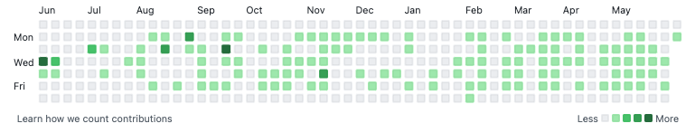

# Configuring Git

## Introduction

Once you have an appropriate version of Git installed, the next step is to configure Git so it can connect to your GitHub account.

## Objectives

You will be able to:

* Use basic commands to navigate the command line
* Practice utilizing Git and GitHub

## Elements of Configuring Git

The purpose of configuring Git on your computer is so that GitHub (the website) can sync with software running on your computer. There are two main reasons for performing this configuration.

First, you want to be able to **push** changes made locally to the remote (GitHub) version of a repository. To do this you will need to set up a **token or key** that authenticates your computer's identity with GitHub.

Second, you want to be able to track your **contributions** on GitHub, which are automatically displayed in a graph like this on your GitHub profile:



To track contributions, you need to have your local Git settings set up with the **email** that matches the email associated with your GitHub account.

In this lesson you'll walk through all of the necessary setup steps, then create a new GitHub repository and test out your configuration.

If you already have a basic understanding of Git and navigating in the terminal, feel free to skip down to the "Cheat Sheet" section near the bottom of this lesson. This includes instructions without the addition of explanations or troubleshooting tips.

## Setup on GitHub

Complete these steps in the browser using GitHub.com.

### GitHub Authentication

If you do not have authentication set up, you will not be able to push changes to GitHub.

There are two different ways for your computer to be authenticated when you try to push code to GitHub. You can use either way, but we have found that the **personal access token** approach is easier for most students.

#### Recommended Approach: Personal Access Token

Personal access tokens (also called PATs) are used with the **HTTPS** GitHub clone links.

The idea of a PAT is that GitHub generates a token, then you save that token and use it as your password when you push changes. The difference between a token and just using your GitHub login password is that the token can have a more limited scope (e.g. you might be able to push with a token, but not add new users to a repo) and also can be set to expire. Tokens are therefore a better practice than passwords from a computer security perspective.

Follow the instructions [here](https://docs.github.com/en/authentication/keeping-your-account-and-data-secure/creating-a-personal-access-token) to generate a token. We recommend that you set the **Expiration** to a time after the DS program is complete, and set the **Scope** to **repo**. Copy the generated token, and **paste it somewhere reasonably secure** (a file on your computer, in a password manager, in a secure messaging app, etc.). You will need to paste it into the terminal prompt later on, and won't be able to view it on GitHub again.

#### Alternative Approach: SSH

SSH keys are used with the **SSH** GitHub clone links.

The idea of SSH authentication is that your computer generates public and private keys, then you save the public key to your GitHub account. Then when you push changes, GitHub uses that key to authenticate. If you are already comfortable working in the terminal, and possibly already have generated SSH keys, then SSH will be an effective way to log in. We also have instructions [here](https://docs.google.com/document/d/16ILY1gpqf57D5A_O8x7mJlsqT9-FH5jB51F0kKWMEYQ/edit).

#### Key Takeaway: Clone Link Must Match Authentication Strategy

You need to set up a way for GitHub to confirm your identity, and the clone link needs to match your setup.

* If you choose the **PAT** approach (recommended), you need to use the **HTTPS** clone link.
* If you choose the **SSH** approach (alternative), you need to use the **SSH** clone link.
* You can also set up both approaches if you really want to, but this is not necessary.

### Creating a New GitHub Repository

You can't just push to any GitHub repository you want. Imagine the chaos if any random user could make arbitrary changes to popular open-source projects! Instead you need to be granted permission to make changes to a particular repository. One way to guarantee that you have permission is to make a new GitHub repository yourself, so we're going to do just that.

This repository is just being used for practice, so it can use any name you want.

Go to https://github.com/new to make a new repository. Type in a name, set the visibility to **Public**, make sure you check the box next to **Add a README file**, then click the **Create repository** button at the bottom.

## Getting Credit for Contributions

Complete this part in your terminal. Remember, when we say "terminal" we mean the Terminal app for Mac, the Git Bash program for Windows, and the command line/shell for Linux.

If you skip this step, you'll still be able to push to GitHub, but you won't get credit for your edits. Because your GitHub profile is an important part of your final DS portfolio, we highly recommend that you configure Git with your author information so that you get the credit you deserve!

1. In your terminal window, run `git config --global user.name`
    - If it returns your name, you’re set!
    - If it returns nothing or displays an error message, run `git config --global user.name "Your Name"` - replacing `Your Name` with your name inside the quotes (this should be your real first and last name, not your GitHub username).
      - For example, if your name were Alan Turing then you would run `git config --global user.name "Alan Turing"`.
    - Then run `git config --global user.name` again to confirm that it is displaying your name correctly
2. In your terminal window, run `git config --global user.email`
    - If it returns the email address associated with your GitHub account, you’re set!
    - If it returns nothing or displays an error message, run `git config --global user.email <your email>` - replacing `<your email>` with the primary email address associated with your GitHub account.
      - For example, if your email address were your@email.com then you would run `git config --global user.email your@email.com`
      - If you aren't sure what email address is associated with your GitHub account, you can check at this URL: https://github.com/settings/emails (you'll need to log in)
      - This setting exposes your email address online. If you have privacy concerns, GitHub also offers a no-reply email that can be used for this purpose. Go to https://github.com/settings/emails, check "Keep my email addresses private", and run the `git config` command using the specified email ending with `@users.noreply.github.com` instead of using your personal email
    - Then run `git config --global user.email` again to confirm that it is displaying your email correctly

## Testing Git Configuration

Now it's time to test out your credentials!

### Cloning the Repository Locally

Once the repository has been created, click the `<> Code` button and choose HTTPS if you set up a PAT or SSH if you set up an SSH token. Copy the provided link, and go back to your terminal window.

#### Moving to an Appropriate Location

If you are already familiar with navigating the terminal, feel free to clone the repository wherever works best for you. If not, you can follow the exact steps listed below:

1. Run `cd ~/Documents` - this will change your directory, and move you into your Documents folder
   - If this line gives you an error, that means you don't have a "Documents" folder. Try running `mkdir ~/Documents && cd ~/Documents` instead
2. Run `mkdir Flatiron` - this will create a new folder, called Flatiron, to keep all of your Flatiron repositories and files
3. Run `cd Flatiron` - this will change your directory, moving you into the new Flatiron folder you just created

#### Cloning the Repository

Now that you are in an appropriate place, run `git clone <clone url>`, where `<clone url>` has been replaced with the URL you copied from GitHub. For example, if your URL was `https://github.com/learn-co-curriculum/dsc-git-configuration.git` the command would be `git clone https://github.com/learn-co-curriculum/dsc-git-configuration.git`.

_In Windows, in Git Bash, to paste from the clipboard the shortcut should be **shift-insert**._

This will create a new subdirectory whose name is the same as the repository name on GitHub!

If you are prompted for a username and password, this means you accidentally made the repository private rather than public. Follow the instructions [here](https://docs.github.com/en/repositories/managing-your-repositorys-settings-and-features/managing-repository-settings/setting-repository-visibility#making-a-repository-public) then once you have saved the visibility settings, try again to clone.

#### Moving into the Repository

Run `cd <repo name>` where `<repo name>` has been replaced with the name of the repository. For example, if your repository was `dsc-git-configuration` then the command would be `cd dsc-git-configuration`.

Note that you can speed up this process by typing the beginning of the name (e.g. just "dsc-git" for the example above) then hitting the **tab** key to "tab complete" the name. Especially for long file or directory names this can save you a lot of time!

### Editing the Repository

#### Modifying the README

Right now the repository has a file called `README.md` that includes just the name of the repository with a `#` in front of it. Let's edit that file, then push changes back to GitHub!

Run this command in the terminal to add a new line to `README.md`:

```bash
echo "new stuff" >> README.md
```

This will add a line containing "new stuff" to the README!

(You can also change the contents inside the quotes to something different, although you'll need to avoid using characters like `!` and `/` that have special meanings in the terminal.)

#### Committing Edits in Git

Now, run this command so that your changes are saved as a "commit" in Git:

```bash
git commit -am "edit README.md"
```

You should see an output that says something like `1 file changed, 1 insertion`.

#### Checking for Author Credit

You now should have a commit with your name and email attached to it. Run this command and make sure that your correct name and email appear as the author:

```bash
git log --format=short
```

If that shows the incorrect name or email, go back to the Getting Credit for Contributions section and make sure you have performed the correct steps.

- Once that information is corrected, run `git commit --amend --no-edit --reset-author` to update the author info
- Then run `git log --format=short` again to confirm that the author information is correct

### Pushing Changes

Now that you have confirmed edits locally it's time to push them to GitHub!

Run this command in the terminal:

```bash
git push
```

If you used PAT authentication, you will be prompted for a username, then a password. Enter your GitHub username, then **paste in your personal access token** when prompted for a password. If you enter your GitHub password, it will not work.

- For Mac users this typically will automatically add the PAT to the Keychain, so you won't need to enter it the next time you push changes. If this is not working or you are using Windows or Linux, consider using a password manager or the [Git Credential Manager](https://github.com/GitCredentialManager/git-credential-manager) to store your access token.

If you used SSH authentication, you will be prompted for a passphrase only if you set one, otherwise the push will complete automatically.

This command should result in some output like `Counting objects`, `Writing objects`, etc. If you do not get an error message and you are no longer seeing new lines being printed out, go back to the browser and refresh the page to see the edits to the README.

If you see your edits on GitHub, this means you successfully configured Git!

## "Cheat Sheet"

These are the recommended setup steps without the extra clarifications provided earlier.

1. Follow the instructions [here](https://docs.github.com/en/authentication/keeping-your-account-and-data-secure/creating-a-personal-access-token) to generate a personal access token, specifying an expiration after the program is over and a scope of "repo". Copy and paste the token somewhere private but accessible
2. Go to https://github.com/new to make a new repository with a README
3. Run these two commands in the terminal to set your author info, replacing `Your Name` and `<your email>` with appropriate information:
```bash
git config --global user.name "Your Name"
git config --global user.email <your email>
```
4. Run these commands in the terminal to create a new folder to store your Flatiron materials:
```bash
cd ~/Documents
mkdir Flatiron
cd Flatiron
```
5. Clone your new repository using this command, replacing `<clone url>` with the HTTPS clone URL copied from the new GitHub repository
```bash
git clone <clone url>
```
6. Change directory into the cloned repository using this command, replacing `<repo name>` with the name of the repository on GitHub:
```bash
cd <repo name>
```
7. Edit and commit changes to the repository with these commands:
```bash
echo "new stuff" >> README.md
git commit -am "edit README.md"
```
8. Push changes to GitHub with this command:
```bash
git push
```
   - When prompted for a username, enter your GitHub username
   - When prompted for a password, enter your personal access token
9. Confirm that the changes have pushed by refreshing the repository page on GitHub in the browser

The configuration was successful if you were able to push changes to your repository.

## Summary

If you've gotten this far, you have at least one commit on GitHub and are well on your way to building a technical portfolio. Congratulations!
